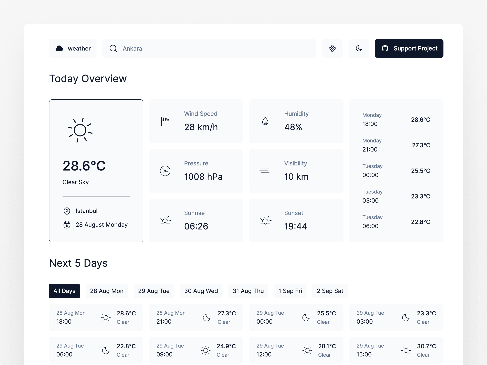

# Weather

Quickly access accurate weather information with a clean, modern and user-friendly design.

## Installation

Clone the repository and install dependencies using npm:

`npm install`

## Usage

Start the development server:

`npm run dev`

This will open the app in your default browser.

Build the app for production:

`npm run build`

Preview the production build:

`npm run preview`

## Contributing

If you find any issues or have suggestions for improvement, please open an issue or submit a pull request on GitHub.

## License

This project is licensed under the MIT License.
